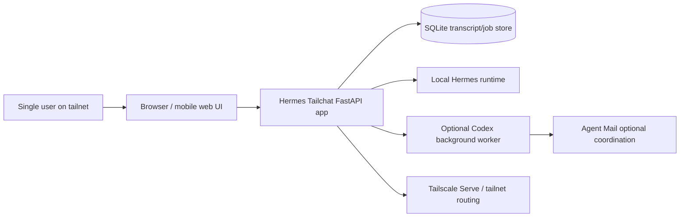

# hermes-tailchat — C4-lite structure

This is a minimal standard-views artifact, not a custom framework.

## Context

## Container view

| Container | Responsibility | Main interfaces |
|---|---|---|
| Browser UI | chat UI, SSE consumption, approval actions | HTTP + SSE |
| FastAPI app | conversation/job APIs, event publication, orchestration | routes, SSE, local process calls |
| SQLite store | canonical transcript, runs, jobs, approvals, events | app store layer |
| Local Hermes provider | foreground interactive run execution via Hermes internals | provider callbacks, approvals |
| Codex background worker | repo-facing background jobs with artifacts and limited retry | subprocess runner + artifact dir |
| Tailscale Serve | tailnet-only exposure and optional `/hermes` subpath routing | reverse proxy / path prefix |

## Component hints inside the FastAPI app

| Component | Role |
|---|---|
| `app/main.py` | API routes, lifecycle, recovery, SSE publication |
| `app/store.py` | persistent state management |
| `app/hermes_provider.py` | local Hermes session/run orchestration and approval integration |
| `app/codex_runner.py` | Codex background subprocess orchestration |
| `app/untrusted_ingest.py` + sanitizer path | deterministic reduction before lower-privilege semantic inspection |
| `app/broker.py` | live event fanout |

## Structural observations

- Tailchat is not just a CRUD app; it is an **orchestrator around local agent runtimes**.
- SQLite is part of the architecture, not just storage plumbing, because replay/recovery/approval state depend on it.
- Hermes and Codex execution paths are separate containers/authority domains even though they are launched from the same app.

## Keep / drop judgment

Keep this if it helps orient future design and review work quickly.
Drop it if it becomes stale or if the runtime boundaries change faster than the doc can track.
