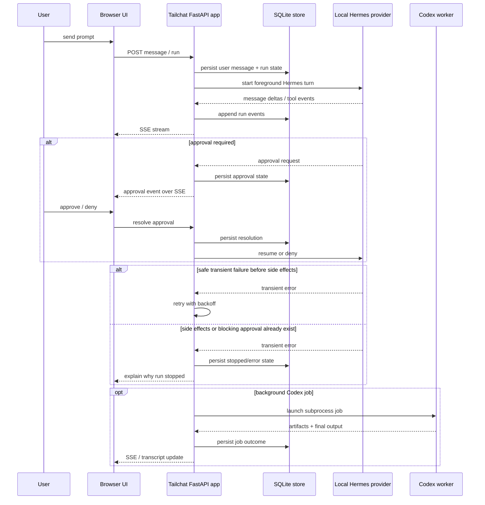

# hermes-tailchat — run / approval / retry / trust sequence

This artifact combines two standard ideas:
- sequence/event-flow view
- trust-boundary notes

## Sequence view

## Trust boundaries that matter

### Boundary 1: browser vs app
- browser can request actions
- browser must not directly unblock Hermes
- approval decisions become real only when validated and persisted by the app

### Boundary 2: app vs local Hermes runtime
- app has authority to construct runs, receive tool events, and mediate approval state
- Hermes path is high-authority because it can reach rich tools and local session state

### Boundary 3: app vs Codex background worker
- Codex path is intentionally narrower and artifact-oriented
- retry rules are stricter to avoid duplicated repo side effects after output has begun

### Boundary 4: untrusted input vs stronger consumers
- hostile inputs should be reduced first
- optional low-privilege sanitizer consumes normalized artifacts
- only sanitized summaries should move toward stronger consumers by default

## Insights from the sequence view

- Retry policy is architecture, not polish.
- Approval persistence is architecture, not just UX.
- The split between Hermes and Codex is meaningful because authority and failure semantics differ.
- The untrusted-ingestion subsystem is best reasoned about as a trust-boundary pipeline.

## Keep / drop judgment

Keep this if it helps review changes to retry, approval, or ingestion logic.
Drop it if nobody uses it during design/review and the code is clearer on its own.
